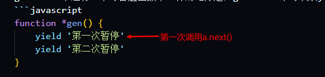
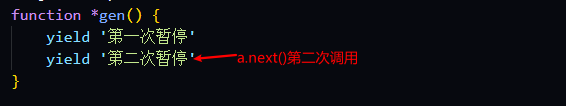

# 异步(generator)

## what is generator(什么是generator)?
是es6里面新的一个处理异步的方式(相比于回调函数，promise)

## why is generator(为什么要使用generator)?
写法方便 异步写法类似于同步的写法

```javascript
function *testGenerator() {
    // xxxx 是一个异步操作 res就是该异步操作的结果
    // xxxx 里面有条件 具体实现后面会详细讲解
    let res = yield xxxx()
    console.log(res)
}
```

## how is generator(如何才能构造一个generator)?
一般来说，在function与函数名之间加上一个*。这个函数就变成了一个generator函数。
```javascript
function *main() {}
function* main() {}
function * main() {}
function*main() {}
```
generator中*号的位置无所谓。

下面这也是个generator
```javascript
// 函数表达式
let gen = function *() {}
```

上面大致是generator的内容，大概只介绍了5%的generator的知识。下面将详细的讲解generator的内容。

分两部分吧，首先介绍generator的基础知识，然后是generator在javaScript异步编程中的应用。

## generator 的基础知识
generator内部内容与普通函数一模一样。

```javascript
function *gen() {
    console.log('i am a generator, like normal function!')
    console.log('我是一个生成器函数，和普通函数差不多')
}

var a = gen()
a.next()  // gen函数开始执行
```
不过，当执行generator时和普通函数可是完全不一样了。

首先，看var a = gen()，gen()执行返回了一个遍历器对象(所有的generator执行都会产生一个迭代器对象)。
当这个遍历器对象被调用时，也就是a.next()，gen()函数中内容会被执行。

所以这是第一个generator函数与普通函数不同的地方， gen()执行，内部的代码不会立马运行，只是先返回一个遍历器对象。
当这个遍历器对象被调用的时候，generator函数内部的代码才会运行。

> 什么是遍历器对象，可以查看[阮一峰的es6](https://es6.ruanyifeng.com/#docs/iterator)

**generator 中yield表达式**

generator中还有一个与普通函数不一样的地方是，generator中可以放yield表达式。
```javascript
function *gen() {
    yield '第一次暂停'
    yield '第二次暂停'
}

var a = gen()
a.next()  // {value: "第一次暂停", done: false}
a.next()  // {value: "第二次暂停", done: false}
a.next()  // {value: undefined, done: true}
```

上面代码可以看到，var a = gen() 产生了一个遍历器对象a，此时我们调用a.next()。
输出了 {value: "第一次暂停", done: false}。

由此可见，yield后面的内容会直接被遍历器对象a直接访问到，并且作为它的value值返回出来。



其实，yield的作用不仅如此。

它还会中断当前的generator，当我们继续执行a.next()的时候。
此时输出了 {value: "第二次暂停", done: false}
说明此时遍历器对象a访问了 第二个yield后面的值。



当我们第三次执行或者第四次执行 a.next() 的时候，返回的值是：
`{value: undefined, done: true}`

此时没有yield表达式，返回的值也就为空。

由上可知，generator中yield有以下两个特点
- yield 后面的表达式的值会被 generator 执行产生的遍历器对象访问到
- yield 会中断 generator 的执行，想要继续执行 generator 就要让遍历器对象继续执行下去

**遍历器对象的next() 的传参**

yield 后面表达式的值 会被`遍历器对象`next()访问到，但是yield 也是可以有返回值的。

不过，yield的返回值是 `遍历器对象`next()方法的传参。

```javascript
function *gen() {
    const a = yield 'yellres'
    console.log(a)
}

var a = gen()
a.next()    // {value: 'yellres', done: false}
a.next('strongest') 
// 'strongest' 
```

不过要注意是，拿到 yield 的返回值，必须要调用两个next()。第一个next() 执行会被yield 给中断，第二次next() 执行会把参数作为 yield 的返回值。 

由此可见这是一种双向传值的过程。
- yield 后面的内容会被遍历器对象访问到。
- 遍历器对象的next(xx) 中的 xx 会作为 yield 的返回值。

不过正是这种双向传值的过程，让人们在异步调用中发现了 generator 的优秀之处。

## generator 在异步中的使用

> 拿node.js读取文件 fs.readFile 来举例

```javascript
const fs = require('fs')
fs.readFile('xxxx地址', function(err, data) {
    if (err) throw err 
    if (data) {
        // ... 对数据的操作
    }
})
```
这是回调函数处理异步的方法，不过我们可以使用generator 来修改下。
```javascript 
const fs = require('fs')

function readFileGen(url) {
    fs.readFile('xxxx地址', function(err, data) {
        if (err) it.throw(err)
        if (data) {
            // 把data给 yield 返回出来 
            it.next(data)            
        }
})
}

function *main() {
    try {
        let y = yield readFileGen('文件地址')
        console.log(y)
    }
    catch(err) {
        console.error(err)
    }
}

var it = main()
it.next()
```

第一眼看上去，与之前的回调代码对比起来，这段代码更长一些，可能也更复杂一些。
但是，不要被表面现象欺骗了！生成器代码实际上要好得多！不过要解释这一点还是比
较复杂的。

最重要的代码是这一段：
```javascript
    let y = yield readFileGen('文件地址')
    console.log(y)
```
这段代码中 readFileGen 调用了 fs.readFile , 很显然这是异步函数。但是我们可以得到其中的值。
就类似于：

`var data = fs.readFile('xx')`

但是，这段代码不能工作！你能指出其中的区别吗？区别就在于生成器中使用的 yield。

在 yield readFileGen('文件地址') 中，首先调用 readFileGen('文件地址')，它没有返回值（即返回 undefined），但是
我们有一个读取文件的请求，这没问题，因为这段代码当前并不依赖 yield 出来的值来做任何事情。

现在我们使用yield 现在只是为了中断当前代码的执行。
所以，generator 在 yield 处暂停，那么什么时候 generator 会继续执行呢？ 谁来回答这个问题呢？

看看我们的 readFileGen(..) 如果fs.readFile读取成功后，我们调用：
it.next(data)

这会用恢复生成器，意味着我们暂停的 yield 表达式直接接收到data。然后
随着生成器代码继续运行，这个值被赋给局部变量 y，被console.log输出。


